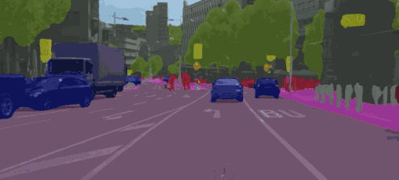
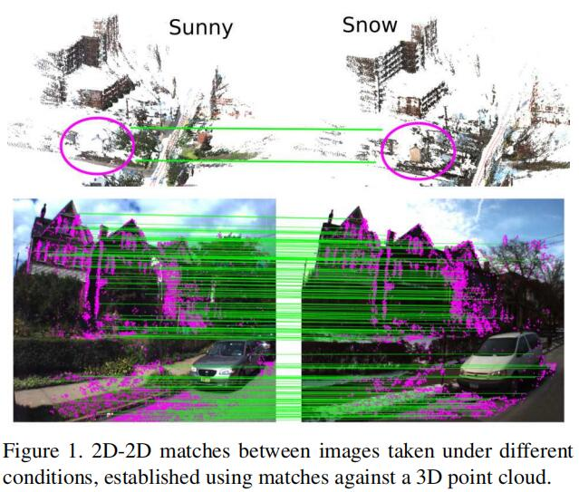

## 用于鲁棒语义分割的跨季节对应关系数据集  
## Notes of Cross season correspondence datasets  

---
**Datasets**: *[Visual Localization](https://www.visuallocalization.net/)*  
**Code**: *[Cross Season Segmentation](https://github.com/maunzzz/cross-season-segmentation)*  
**Paper**：*[A Cross-Season Correspondence Dataset for Robust Semantic Segmentation](https://arxiv.org/abs/1903.06916) 用于鲁棒语义分割的跨季节对应关系数据库*  

这篇论文发布在CVPR2019上，描述了一种基于对应关系的跨季节数据集，这一数据集提出了一种新的方法来提高神经网络在跨季节数据集上的语义分割性能，使用文章提出的方法能有效提高语义分割的准确性，并且能极大地降低数据集中图片标签的人工标注成本。  

在文章中，作者提出利用不同摄像条件下(光照、季节变换)拍摄的2D-2D点匹配来训练卷积神经网络，测试结果表明在训练过程中添加跨季节变化及白天到晚上的像素对应关系作为额外监督能提高神经网络进行语义分割的性能，使其在应对季节和天气条件的变化时更加稳健。

那么问题来了，什么是**语义分割**?  
### **语义分割Semantic Segmentation**  
---
人类如何描述看到的场景呢？我们可能会这么描述：图片中有一栋靠近街道的房子，房子周围环绕着修剪好的灌木，路边停着一辆白色的车。不难发现，人类对于图像的理解的关键之一在于将作为一个整体的图片分割为多个实体来理解，这样有助于我们区分静止的背景和运动的实体，进而能预测和分析目标可能出现的行为。而语义分割就是计算机视觉中将场景分割为实体的方法。通俗来讲，语义分割有助于计算机理解图片中各个不同实体的含义。下图以可视化的方式展示了常见语义分割方法的效果：  

  
语义分割效果示例

而语义分割的主要任务就是将标签分配给图像的每个像素，作为计算机视觉的基本任务之一，语义分割也用于更高级别的场景理解，如密集的3D重建、SLAM即时定位与地图构建、SFM运动恢复结构和位置识别等等。由于当前正在发展的无人驾驶和智能机器人技术，精确的语义分割变得越来越重要。

### **训练集标注方法**
近年来，随着神经网络的进步，语义分割的性能在不断地增长，经过良好训练的语义分割网络能达到很高的语义分割性能，但训练这些网络需要大量经过人工精注释的图像。对一个动辄数万张图片的数据集进行人工标注无疑是非常耗时费力的工作，目前提出的降低成本的弱监督方法是使用边界框标签、图像级标签或点标签来进行注释，而论文中则提出使用一种半自动获取图片对应关系的方法来代替人工标注的方法。  

这种方法基于以下的基本思想，即: *场景的语义含义在季节等环境变化的条件下不发生变化，因此才能在图像外观的匹配失效时通过语义建立2D-3D匹配.*  
论文提出通过寻找在不同条件下拍摄的同一场景的多张图片中的对应关系来对图片进行标注，首先通过图像几何匹配的方法来建立3D模型，通过3D模型和2D图片中的对应点来建立两张图片中的2D-2D匹配关系，由于不同的季节和光照条件下，实体的语义不发生变化，因此可以认为这些对2D-2D匹配点所含的语义是相同的。由此将两张图片的匹配点赋予相同对应关系的标签，并将这种对应关系的约束加入到训练过程中。 

   
2D-2D匹配和对应关系的建立

### **文章相关技术**  
除了语义分割以外，文章中还提到了其他的一些相关研究。对深度学习基本步骤和3D重建有基础知识可以跳过。    

***域自适应学习Domain Adaptation：*** 域自适应这一方向近年来研究相当火热，其中一部分原因是因为GAN、GNN以及其他一些网络结构的启发。域自适应(Domain Adaptation)乍一看去较难理解是什么意思。其实只要使用机器学习和深度学习方法，这一技术都有应用。传统的机器学习算法中, 通常假设训练样本和测试样本来自同一概率分布, 然后设计相应的模型和判别准则对待测试的样例的输出进行预测. 但是实际上当前很多学习场景下训练样本的概率分布和测试样本的概率分布是不同的, 例如通过对老用户的垃圾邮件学习后应用于新用户的垃圾邮件过滤这种应用场景，如何在当源域与目标域分布不一致时进行学习，就是域自适应所研究的问题，因此域自适应旨在如何客服源域分布与目标域分布不同，以实现源域上的学习任务和目标域上的预测任务。
在文末附有CVPR2019中的几篇域自适应论文以供参考。  

在本文中，作者提到目前常用的几种针对密集预测任务的域自适应方法，其中大部分使用合成数据集，如自动合成大量带注释的图像、使用图像转换方法（如在执行语义分割之前将源图像转换为目标图像）另一种常见的方法则是使用对抗训练设置，鼓励网络产生欺骗域鉴别器的特征。  
作者对提出的新域自适应方法进行了描述，该方法使用与源域不同的图像提高鉴别器的性能。具体来讲，在文中提到的对应关系数据集中，不同拍摄条件和不同季节的图像可以视为目标域。不同于使用无监督域自适应的方法，论文中提出的方法利用2D图像对应的3D几何一致性作为监督，因此跨季节对应关系数据集有助于在不同的目标域中调整分割方法。

***语义三维映射Semantic 3D Mapping:*** 论文中使用的三维结构重建方法基于数张同场景图像的几何重建。近年的研究中较为常见的三维重建方法往往使用了体积像素体（voxel volume）来代表场景以及多张图片共同表示的几何和语义含义。虽然通过语义进行重建往往能获得更加一致而且更加完整的3D模型，但这些方法明显比使用2D-3D几何映射重建要复杂得多，基于语义的重建方法需要考虑语义和联合预测深度，或是使用深度信息来辅助重建，这些手段无一例外地依赖于经过标注的数据。而论文中所述的方法则没有以上所述的限制。  

**对应关系语义的损失函数Semantic Correspondence Loss**  

***-***
### **实现过程**  
### **损失函数的改进**  
### **在不同数据集下的效果**  
### **发展方向**

---  
附：  
域自适应方向论文CVPR2019:  
[1.Taking A Closer Look at Domain Shift: Category-level Adversaries for Semantics Consistent Domain Adaptation（域迁移: 类别级对抗用于语义一致的域自适应](https://arxiv.org/abs/1809.09478)  代码:[https://github.com/RoyalVane/CLAN](https://github.com/RoyalVane/CLAN)
[2.AdaGraph: Unifying Predictive and Continuous Domain Adaptation through Graphs（AdaGraph: 通过图形统一预测和连续域自适应）](https://arxiv.org/abs/1903.07062)
[3.Domain-Symmetric Networks for Adversarial Domain Adaptation（用于对抗域自适应的域对称网络）](https://arxiv.org/abs/1904.04663)