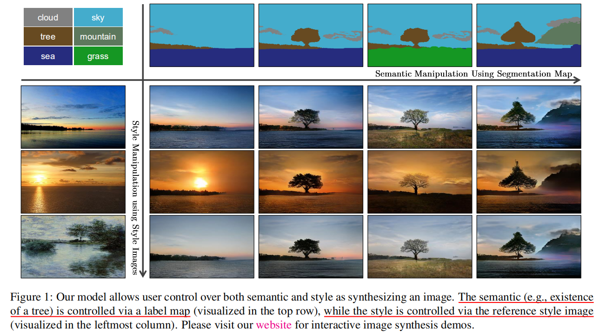

## SPADE论文笔记  Notes of SPADE thesis

**Project Page**：*[SPADE Project Page](https://nvlabs.github.io/SPADE/)*  
**Code**: *[NVlabs/SPADE: Semantic Image Synthesis with SPADE](https://github.com/nvlabs/spade/)*  
**Paper**：*[Semantic Image Synthesis with Spatially-Adaptive Normalization](https://arxiv.org/abs/1903.07291) 基于空间自适应归一化的语义图像合成*  

---
这篇文章是我第一次以博客形式记录我的学习心得，笔法生涩， 不过我相信只要迈出第一步，一定会越来越好的！ 好了，废话少说，进入主题。

NVIDIA的这篇文章将其算法称为SPADE，对应文章中所写到的*Spatially-Adaptive Normalization*。但其本质其实是NVIDIA在2019年GTC中推出的GauGAN算法，也被人称为神笔马良，这一算法可以通过输入用户所画的简单轮廓图像，合成为真实图像，在合成的同时还可以选择合成图像的风格  
